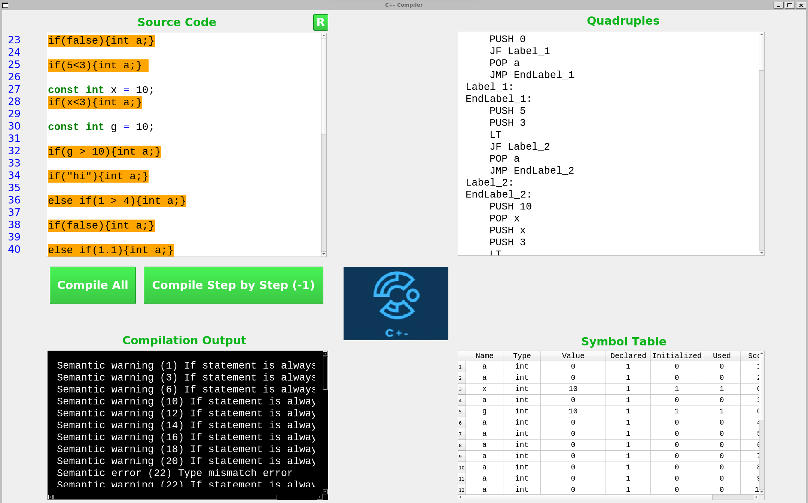
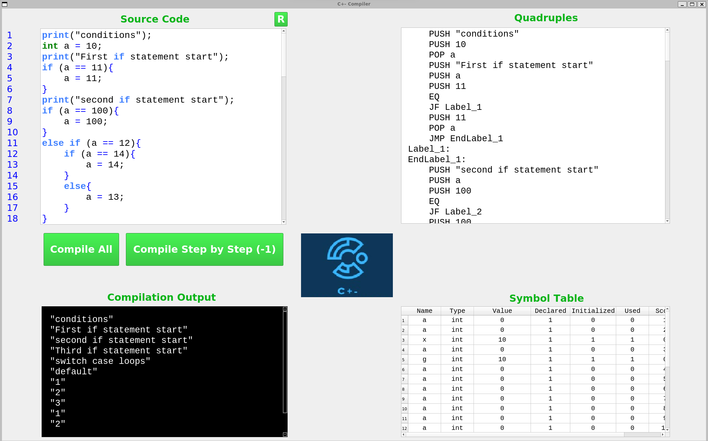
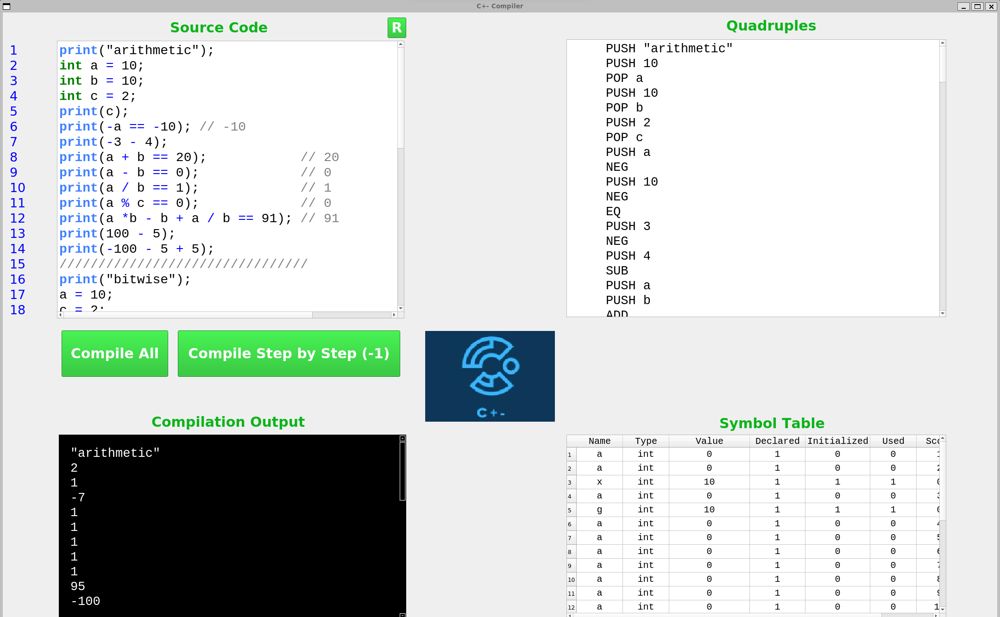
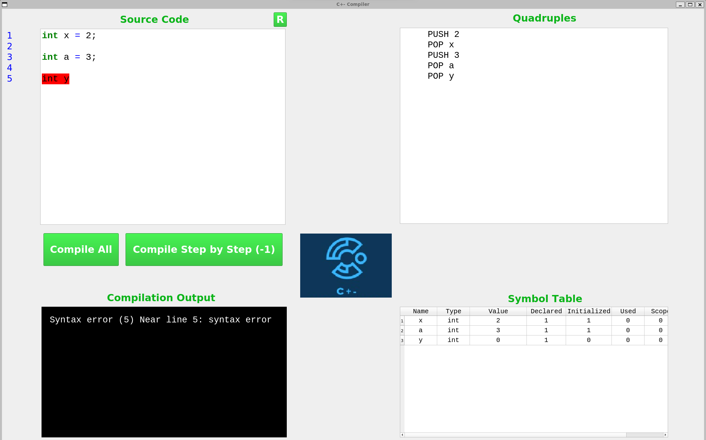
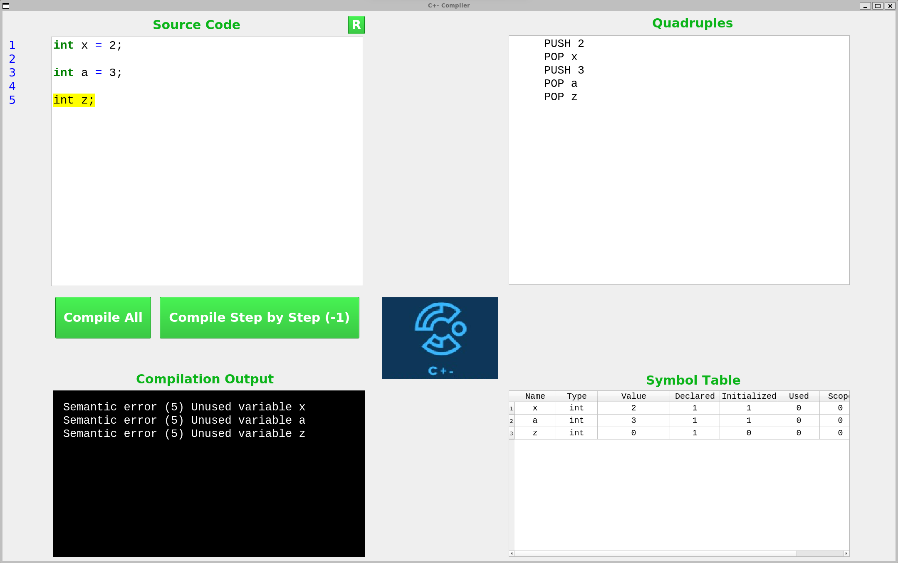

# C Plus Minus


## Table of Contents

- [C Plus Minus](#c-plus-minus)
  - [Table of Contents](#table-of-contents)
  - [Introduction](#introduction)
  - [Run Steps](#run-steps)
  - [Tools and Technologies](#tools-and-technologies)
  - [Tokens](#tokens)
  - [Syntax](#syntax)
    - [Data Types](#data-types)
    - [Operators](#operators)
    - [Conditional Statements](#conditional-statements)
    - [Loops](#loops)
    - [Functions](#functions)
    - [Enumerations](#enumerations)
  - [Quadruples](#quadruples)
    - [Procedures](#procedures)
    - [Enums](#enums)
    - [Variables](#variables)
    - [Branching \& Jumps](#branching--jumps)
    - [Arithmetic Operations](#arithmetic-operations)
    - [Bitwise Operations](#bitwise-operations)
    - [Logical Operations](#logical-operations)
  - [Production Rules](#production-rules)
  - [Desktop Application](#desktop-application)

## Introduction

The designed language is a `C` like programming language.

Sample program:

```c
const int a = 5;
float b = 6;
print ("Operations:");
if (a == 5) {
    print ("a is 5");
}
else {
    if (b == 6) {
        print ("b is 6");
    }
    else {
        print ("b is not 6");
    }
}
exit;
```

## Run Steps

- `yacc -d main.y`: create y.tab.h and y.tab.c
- `lex main.l`: create lex.yy.c
- `gcc -g lex.yy.c y.tab.c -o main`: create main
- `./main`: run main

For convenience, the above steps are combined in a makefile. To run the makefile, type `make <test case name>` in the terminal.

## Tools and Technologies

<ol>
   <li>Lex: It breaks down the input text into a sequence of tokens, which are then passed on to the parser for further processing.</li>
   <li>Yacc: It takes a sequence of tokens as input and produces a parse tree or an abstract syntax tree (AST) that represents the structure of the input according to the grammar rules.</li>
</ol>

## Tokens

<table>
   <tr>
      <th align="left">Token</th>
      <th align="left">Regex</th>
      <th align="left">Description</th>
   </tr>
   <tr>
      <td>DIGIT</td>
      <td>[0-9]</td>
      <td>Number between 0 and 9.</td>
   </tr>
   <tr>
      <td>ALPHABET</td>
      <td>[a-zA-Z]</td>
      <td>Upper case or lower case English letter.</td>
   </tr>
   <tr>
      <td>ALPHANUM</td>
      <td>[0-9a-zA-Z]</td>
      <td>Digit, upper case letter, or lower case letter.</td>
   </tr>
   <tr>
      <td>SPACE</td>
      <td>[ \r\t]</td>
      <td>Single space or tab.</td>
   </tr>
   <tr>
      <td>NEW_LINE</td>
      <td>\n</td>
      <td>New line.</td>
   </tr>
   <tr>
      <td>INLINE_COMMENT</td>
      <td>\/\/.*</td>
      <td>Single line comment.</td>
   </tr>
   <tr>
      <td>MULTILINE_COMMENT</td>
      <td>\/\*.*\*\/</td>
      <td>Multi-line comment.</td>
   </tr>
   <tr>
      <td>arithmeticOps</td>
      <td>[/+*%-]</td>
      <td>Arithmetic operators (+, -, *, /, %).</td>
   </tr>
   <tr>
      <td>bitwiseOps</td>
      <td>[&^~|]</td>
      <td>Bit-wise operators (AND, OR, NOT, XOR).</td>
   </tr>
   <tr>
      <td>endOfStatement</td>
      <td>[;]</td>
      <td>Semi-colon to mark the end of any statement.</td>
   </tr>
   <tr>
      <td>punctuators</td>
      <td>[()={}:,]</td>
      <td>Language punctuators.</td>
   </tr>
   <tr>
      <td>TRUE</td>
      <td>[tT]rue | 1 | [yY]es</td>
      <td>True value.</td>
   </tr>
   <tr>
      <td>FALSE</td>
      <td>[fF]alse| 0 | [nN]o</td>
      <td>False value.</td>
   </tr>
</table>

## Syntax

### Data Types

Tha language supports the following data types:

- Integer
- Float
- Boolean
- String

It supports modifiers like `const` as well.

```c
const int a = 10;
int b = 20;
float c = 10.5;
bool d = true;
string e = "Hello World";
```

### Operators

The language supports the common operators in C.

```c
// Arithmetic operators
a = b + c;
a = b - c;
a = b * c;
a = b / c;
a = b % c;
// Bitwise operators
a = b & c;
a = b | c;
a = b ^ c;
a = ~b;
// Logical operators
a = b && c;
a = b || c;
a = !b;
// Relational operators
a = b == c;
a = b != c;
a = b > c;
a = b >= c;
a = b < c;
a = b <= c;
// Shift operators
a = b << c;
a = b >> c;
```

### Conditional Statements

The language supports the if-else, if-elif-else, and switch-case statements.

```c
int a = 10;
// if statement
if (a == 10) {
    print("if");
    print("another if");
}
elif (a == 11) {
    print("elif");
    print("another elif");
}
else {
    print("else");
    print("another else");
    if (a == 10) {
        print("if");
        print("another if");
    }
    else {
        print("else");
        print("another else");
    }
}
if (a == 10) {
    print("if");
    print("another if");
}
elif(a == 11) {
    print("else");
    print("another else");
}
// switch-case statement
switch (a) {
    default:
        print("default");
        break;
}
switch (a) {
    case 1: 
        print("1");
        break;
    
    case 2: 
        print("2");
        break;
    
    case 3: 
        print("3");
        break;
}

switch (a) {
    case 1: 
        print("1");
        break;
    
    case 2: 
        print("2");
        break;
    
    case 3: 
        print("3");
        break;
    
    default: 
        print("default");
        break;
}
```

### Loops

The language supports the while, for, and repeat-until loops.

```c
// while loop
a = 0;
while (a < 20) {
    print(a);
    a = a + 1;
}
print(a);
while (a < 20) {
    if (a == 10) {
        print(a);
    }
    a = a + 1;
}
// for loop
for (a=2 ; a<10; a = a+1 ) {
    print(a);
}
for (a=2 ; a<10; a= a+1 ) {
    print(a);
    b = a;
    while (b < 10) {
        if (b == 5) {
            print("hi");
            print(b);
        }
        
        b = b + 1;
    }
}
// repeat-until loop
a = 0;
repeat {
    print(a);
    a = a + 1;
    print(a);
} until (a == 1);
repeat {
    print(a);
    a = a + 1;
    if (a == 1) {
        print(a);
    }
} until (a == 1);
```

### Functions

The language supports functions with and without parameters.

```c
int y (){
    print("y");
    return 1;
}
int x(int a, int b) {
    print("add");
    return a + b;
}
x(1, 2); // function call
a = y(); // function call and assignment
```

N.B.: you can't define a function inside any scope.

### Enumerations

The language supports enumerations.

```c
enum Color{
    RED=10,
    GREEN,
    BLUE=12,
    RED
};
{
    Color c1;
    Color c2=RED;
    Color c3=3+5;
}
```

## Quadruples

### Procedures

 **Quadruples** | **Description**                                                   |    **ARG1**     |    **ARG2**     |    **RES**      |
----------------|-------------------------------------------------------------------|-----------------|-----------------|-----------------|
 **PROC**       | Start of a procedure                                              | procedure name  |                 |                 |
 **ENDPROC**    | End of a procedure                                                | procedure name  |                 |                 |
 **CALL**       | Calls a procedure, handles all the stuff related to the PC        | procedure name  |                 |                 |
 **RET**        | Return from  a procedure, handles all the stuff related to the PC |                 |                 |                 |

### Enums

 **Quadruples** | **Description**                                                   |    **ARG1**     |    **ARG2**     |    **RES**      |
----------------|-------------------------------------------------------------------|-----------------|-----------------|-----------------|
 **ENUM**       | Start of an enum                                                  |   enum name     |                 |                 |
 **ENDENUM**    | End of an enum                                                    |   enum name     |                 |                 |

### Variables

 **Quadruples** | **Description**                                                   |    **ARG1**     |    **ARG2**     |    **RES**      |
----------------|-------------------------------------------------------------------|-----------------|-----------------|-----------------|
 **PUSH**       | Push to the stack frame                                           | Identifier/Expr |                 |                 |
 **POP**        | Pop from the stack frame                                          | Identifier/Expr |                 |                 |
 **CAST**       | Cast the type of the var on the top of the stack to the type of the var to be pop into  |  |                 |                 |

### Branching & Jumps

 **Quadruples** | **Description**                                                   |    **ARG1**     |    **ARG2**     |    **RES**      |
----------------|-------------------------------------------------------------------|-----------------|-----------------|-----------------|
 **JMP**        | Unconditional jump to the label                                   |    label        |                 |                 |
 **JF**         | Jumps to the label if the result of the last operation was false  |    label        |                 |                 |

### Arithmetic Operations

 **Quadruples** | **Description**                                                   |    **ARG1**     |    **ARG2**     |    **RES**      |
----------------|-------------------------------------------------------------------|-----------------|-----------------|-----------------|
 **NEG**        | Get the opposite sign of an expression                            |                 |                 |                 |
 **COMPLEMENT** | Get the complement of an expression                               |                 |                 |                 |
 **NOT**        | Get the bitwise not of an expression                              |                 |                 |                 |
 **ADD**        | Add two numbers                                                   |                 |                 |                 |
 **SUB**        | Subtract two numbers                                              |                 |                 |                 |
 **MUL**        | Multiply two numbers                                              |                 |                 |                 |
 **DIV**        | Divide two numbers                                                |                 |                 |                 |
 **MOD**        | Modulus two numbers                                               |                 |                 |                 |

### Bitwise Operations

 **Quadruples** | **Description**                                                   |    **ARG1**     |    **ARG2**     |    **RES**      |
----------------|-------------------------------------------------------------------|-----------------|-----------------|-----------------|
 **BITWISE_OR** | Get the bitwise or of two numbers                                 |                 |                 |                 |
 **BITWISE_AND**| Get the bitwise and of two numbers                                |                 |                 |                 |
 **BITWISE_XOR**| Get the bitwise xor of two numbers                                |                 |                 |                 |
 **SHL**        | Shift left the number                                             |                 |                 |                 |
 **SHR**        | Shift right the number                                            |                 |                 |                 |

### Logical Operations

 **Quadruples** | **Description**                                                   |    **ARG1**     |    **ARG2**     |    **RES**      |
----------------|-------------------------------------------------------------------|-----------------|-----------------|-----------------|
 **LOGICAL_OR** | Get the logical or of two numbers                                 |                 |                 |                 |
 **LOGICAL_AND**| Get the logical or of two numbers                                 |                 |                 |                 |
 **EQ**         | Check if two numbers are equal                                    |                 |                 |                 |
 **NEQ**        | Check if two numbers are not equal                                |                 |                 |                 |
 **GT**         | Check if the first number is greater than the second              |                 |                 |                 |
 **GEQ**        | Check if the first number is greater than or equal the second     |                 |                 |                 |
 **LT**         | Check if the first number is less than the second                 |                 |                 |                 |
 **LEQ**        | Check if the first number is less than or equal the second        |                 |                 |                 |

## Production Rules

<ul>
   <li>program → statements | functionDef | statements program | functionDef program</li>
   <br>
   <li>statements → statement | codeBlock | controlstatement | statements codeBlock | statements statement | statements controlstatement</li>
   <br>
   <li>codeBlock → { statements } | { }</li>
   <br>
   <li>controlstatement → ifCondition | whileLoop | forLoop | repeatUntilLoop | switchCaseLoop</li>
   <br>
   <li>statement → assignment | exp | declaration | EXIT | BREAK | CONTINUE | RETURN | RETURN exp | PRINT ( exp ) | PRINT ( STRING )</li>
   <br>
   <li>declaration → dataType IDENTIFIER | dataType assignment | dataIdentifier declaration</li>
   <br>
   <li>assignment → IDENTIFIER = exp | IDENTIFIER = STRING | enumDeclaration | enumDef</li>
   <br>
   <li>exp → term | functionCall | - term | '~' term | NOT term | exp '+' exp | exp '-' exp | exp '*' exp | exp '/' exp | exp '%' exp | exp '|' exp | exp '&' exp | exp '^' exp | exp SHL exp | exp SHR exp | exp EQ exp | exp NEQ exp | exp GT exp | exp GEQ exp | exp LT exp | exp LEQ exp | exp AND exp | exp OR exp </li>
   <br>
   <li>term → NUMBER | FLOAT_NUMBER | TRUE_VAL | FALSE_VAL |IDENTIFIER | ( exp )</li>
   <br>
   <li>dataIdentifier → CONST</li>
   <br>
   <li>dataType → INT_DATA_TYPE | FLOAT_DATA_TYPE | STRING_DATA_TYPE | BOOL_DATA_TYPE | VOID_DATA_TYPE</li>
   <br>
   <li>ifCondition → IF ( exp ) codeBlock | IF ( exp ) codeBlock ELSE codeBlock | IF ( exp ) codeBlock ELIF ( exp ) codeBlock | IF ( exp ) codeBlock ELIF ( exp ) codeBlock ELSE codeBlock</li>
   <br>
   <li>whileLoop → WHILE ( exp ) codeBlock</li>
   <br>
   <li>forLoop → FOR ( assignment ; exp ; assignment ) codeBlock</li>
   <br>
   <li>repeatUntilLoop → REPEAT codeBlock UNTIL ( exp ) ;</li>
   <br>
   <li>case → CASE exp : statements | DEFAULT : statements</li>
   <br>
   <li>caseList → caseList case | case</li>
   <br>
   <li>switchCaseLoop → SWITCH ( exp ) { caseList }</li>
   <br>
   <li>functionArgs → dataType IDENTIFIER | dataType IDENTIFIER , functionArgs</li>
   <br>
   <li>functionParams → term | term , functionParams</li>
   <br>
   <li>functionDef → dataType IDENTIFIER ( functionArgs ) codeBlock | dataType IDENTIFIER '(' ')' codeBlock</li>
   <br>
   <li>functionCall → IDENTIFIER ( functionParams ) | IDENTIFIER ( )</li>
   <br>
   <li>enumDef → ENUM IDENTIFIER { enumBody }</li>
   <br>
   <li>enumBody → IDENTIFIER | IDENTIFIER = exp | enumBody , IDENTIFIER | enumBody , IDENTIFIER = exp</li>
   <br>
   <li>enumDeclaration → IDENTIFIER IDENTIFIER | IDENTIFIER IDENTIFIER = exp</li>
</ul>


## Desktop Application
A desktop application is developed using PyQt5 to provide a user interface for the compiler. The application allows the user to select a file from the file system and compile it. The application will then display the generated quadruples, the symbol table, and the results of the executed code. 
- The main functionalities:
    - Open an existing file (Ctrl + O)
    - Write a new file in the text editor
    - Save the file (Ctrl + S)
    - Compile the file in one step
    - Compile the file step by step
    - Display the generated quadruples
    - Display the symbol table
    - Display the results of the executed code
    - Highlight the syntax errors in red
    - Highlight the semantic errors in yellow
    - Highlight the semantic warnings in orange
    - Remove the highlights (Ctrl + R)










